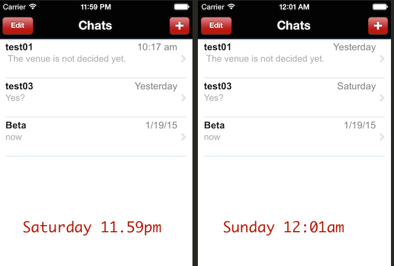
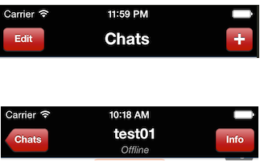

# iOS Interview Questions for NexLabs

## A. Language

### 1. Ivars, Properties, Class Extensions and Categories
With reference [NLMachine.h](https://gist.github.com/kelvin-yong/5aee4c8917715cfe2eae) and [NLMachine.m](https://gist.github.com/kelvin-yong/1e7c2bf0cda7cf7dce6c)

- How many instance variables (or ivars) does the class have, both implicit and explicit? Name the ivars.

- In `NLMachine.m` below, name class feature denoted by `@interface NLMachine()`. Explain the use of the feature and why some properties and ivars are declared within `@interface NLMachine()` instead of the header file.
  
```objc
	@interface NLMachine() {
    	// code omitted
    	...
	}

	// properties
	....

	@end
```
- What's is mean by nonatomic, weak? What other property attributes do you know and when would they be used?

- What are the times you would use ivars over properties and vice versa?

- What is the reason that you see `@synthesize createdDate = _createdDate;`?

- In [code below](https://gist.github.com/kelvin-yong/8e6b5b08a82a1437c176), name class feature denoted by `@implementation NLMachine(AdvancedOps)`? What is the difference between this and the earlier feature? 
  
```objc
	@implementation NLMachine(AdvancedOps)
	// code omitted
	.... 
	@end
```

- Would a property with type IBOutlet usually be strong or weak? Explain the possible reasons why each of the property below is strong or weak.

```objc
  @property (weak, nonatomic) IBOutlet UITableView *myTable;                      // 1
  @property (strong, nonatomic) IBOutlet UISegmentedControl *presenceControl;     // 2
  @property (strong, nonatomic) IBOutlet UITextField *statusTextField;            // 3
  @property (weak, nonatomic) UILabel *nameLabel;                                 // 4
  @property (weak, nonatomic) UILabel *presenceLabel;                             // 5
```

## B. Basics

### 1. Collections: Array and Dictionary

- When would you use NSArray vs NSDictionary (and their mutable counterparts)? When would you use both?

- What would be the output of the following [code](https://gist.github.com/kelvin-yong/81f65bc6aa4d227751ee)? 

```objc
    NSArray *arr = @[@"john", @"jane", @"ellen", @"rose", @"jack"];
    NSMutableArray *mutableArr = [NSMutableArray arrayWithArray:arr];
    
    
    // Part A
    for (NSString *item in arr) {
        if ([item hasPrefix:@"j"]) {
            [arr removeObject:item];
        }
    }
    NSLog(@"%@", arr);


    // Part B
    for (NSString *item in mutableArr) {
        if ([item hasPrefix:@"j"]) {
            [mutableArr removeObject:item];
        }
    }
    NSLog(@"%@", mutableArr);
```

- What about this [code](https://gist.github.com/kelvin-yong/93a09bdc2ee3dbe540c2)?


```objc
    NSArray *arr2 = @[[NSMutableDictionary dictionaryWithDictionary:@{@"name": @"john"}],
                      [NSMutableDictionary dictionaryWithDictionary:@{@"name": @"jane"}],
                      [NSMutableDictionary dictionaryWithDictionary:@{@"name": @"ellen"}],
                      [NSMutableDictionary dictionaryWithDictionary:@{@"name":  @"rose"}],
                      [NSMutableDictionary dictionaryWithDictionary:@{@"name":  @"jack"}]];
    NSMutableArray *mutableArr2 = [NSMutableArray arrayWithArray:arr2];

    for (NSMutableDictionary *item in mutableArr2) {
        if ([item[@"name"] hasPrefix:@"j"]) {
            item[@"name"] = @"xxx";
        }
    }
    NSLog(@"%@", mutableArr2);
```

### 2. NSUserDefaults and Settings.bundle

- Name me some commonly-used instance methods for NSUserDefaults

- In the final version of your app, you need to connect to a network resource via HTTPS. However during client testing, the certificates may not been set up and instead you need to connect via HTTP. You want to that setting in your Settings.bundle to toggle between HTTPS and HTTP. What would you call the setting and why?

	- `PrefHTTPSDisabled` with default value as `YES`
	- `PrefHTTPSDisabled` with default value as `NO`
	- `PrefHTTPSEnabled` with default value as `YES`
	- `PrefHTTPSEnabled` with default value as `NO`

### 3. View and Application Lifecycle

- Discuss life cycle of a view controller

- Discuss application life cycle of the app


## C. Experience

### 1. Xcode
- Share with me some Xcode / development tips and tricks.


### 2. Adhoc build
- You created an adhoc build for your clients to download. They couldn't install the IPA. What are the possible causes and how would you verify the cause?

### 3. Debugging and Instrumenting
- You have a crash and Xcode stops at the file `main.c` at the line `UIApplicationMain(argc, argv, nil, NSStringFromClass([MyAppDelegate class]));`. That's not very helpful. How do you find the line in the code that made the app crash?

- Your tableview scrolls real badly. Very jerky and not smooth at all. What would you do?

- What would you do to determine if your app is leaking memory. Or how much memory it is using?

### 4. Third party libraries
- What are some of the third party libraries that you have used?


## D. Specific Knowledge

### 1. Asynchronous code, NSOperations, Grand Central Dispatch
- Why wouldn't the following [code](https://gist.github.com/kelvin-yong/e699e0ec3745347b331a) work?

```objc
    [_spinner startAnimating];
    self.myImageView.image = [self downloadLargePhotoAndApplyFilter];
    [_spinner stopAnimating];
```

- How would you have written the code?

- Tell me more about about GCD

### 2. CoreData

- Give me an overview of CoreData.

- What are transient properties on a NSManagedObject, and under what scenarios would they be useful?


### 3. Apple Push Notification Service

- Give me an overview of APNS.


### 4. What would you do
- At 11.59pm on Saturday, you see that 3 items are listed along with their relative timestamps. At 12:01am Sunday, the relative timestamps changed. E.g. 10.17 am -> Yesterday and Yesterday -> Saturday. How would you ensure that the user is looking at the right timestamp if he stays on the the same view from 11.59 pm through 12:01 am?  


- How can I create a header that gives me 2 lines of text in the middle?   



- You are using the newest SDK (e.g. 7.0), but need to support older versions of iOS e.g. 6.0). You want to use a class or a particular method only available in 7.0, but the code show not crash if the user is running iOS 6.0. How would you check?

- You are using XCode 6 with SDK 8.1. iOS 9 (along with XCode 7) comes out and you would like to use some class/functions only available in iOS 9. But you do not want to upgrade to XCode 7, so you do not have SDK 9.0. How can you still call the functions?


